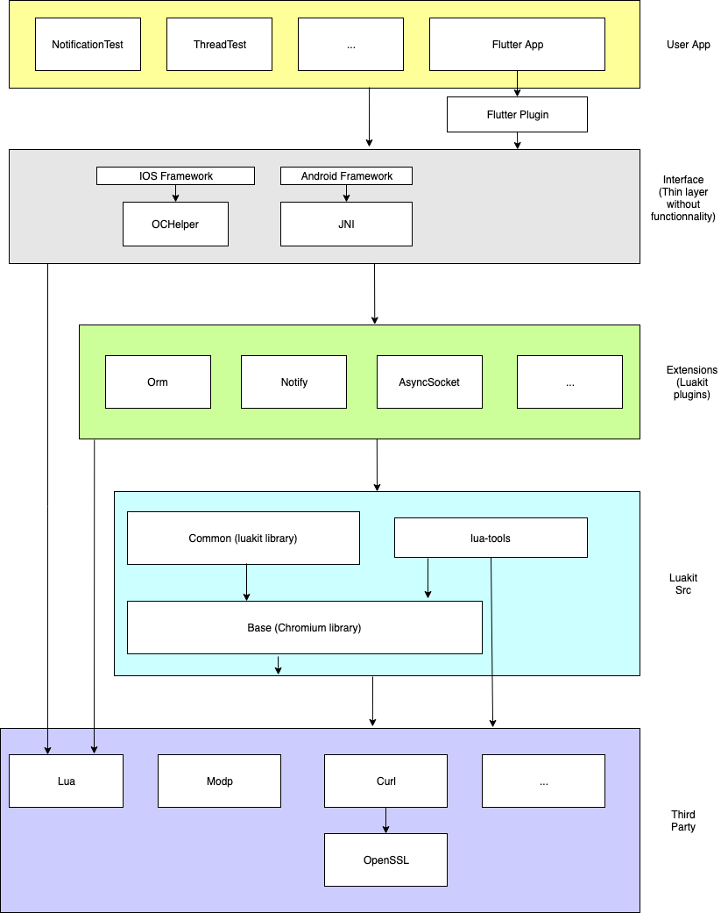

# Luakit Architecture

The arrows mean "depends on ..." or "can call ..."

A correct architecture is one with only downward arrows.

- The only modules wich can call the Luakit extensions (plugins) are the user applications and its layer inteface. Lua is a third party module and cannot call any other module.